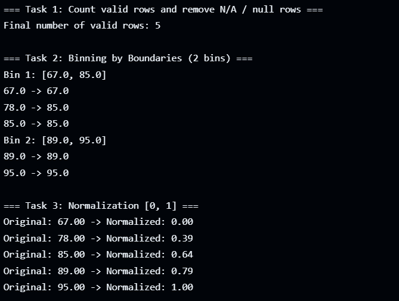

# Assignment 2: Data Preprocessing using Java

## Declaration
This document contains my individual work. No part of this assignment is copied from others. I am aware that a demo of each assignment will be taken, and marks will depend on implementation understanding.

---

## Objective
To perform basic data preprocessing operations on a dataset read from a CSV file. The tasks include removing missing values, binning by boundaries, and normalization.

---

## Tasks Performed

### ✅ Task 1: Remove Missing Values
- Read the CSV file (`dataset.csv`).
- Skip rows where the 3rd column (score) has values `N/A` or `null`.
- Count and display the number of valid rows.

### ✅ Task 2: Binning by Boundaries
- Sort the valid scores.
- Divide the scores into **2 equal bins**.
- Smooth each value by replacing it with the closest bin boundary (either lower or upper value of the bin).
- Display the bins and smoothed values.

### ✅ Task 3: Normalization
- Normalize the scores using **Min-Max Normalization** formula:
$$
\text{Normalized Value} = \frac{(value - min)}{(max - min)}
$$
- Display original and normalized values.

---

## Sample Output

